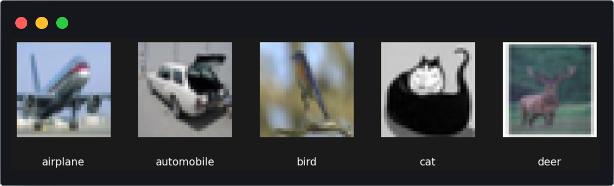
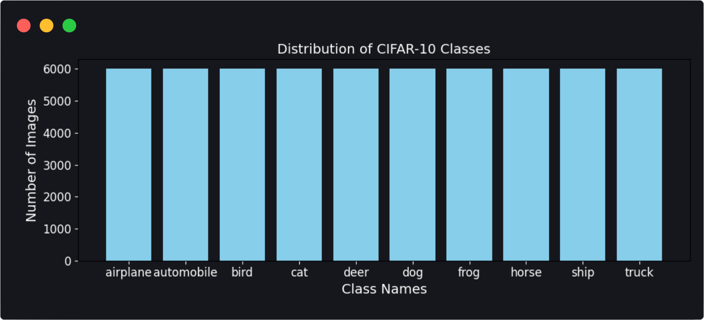
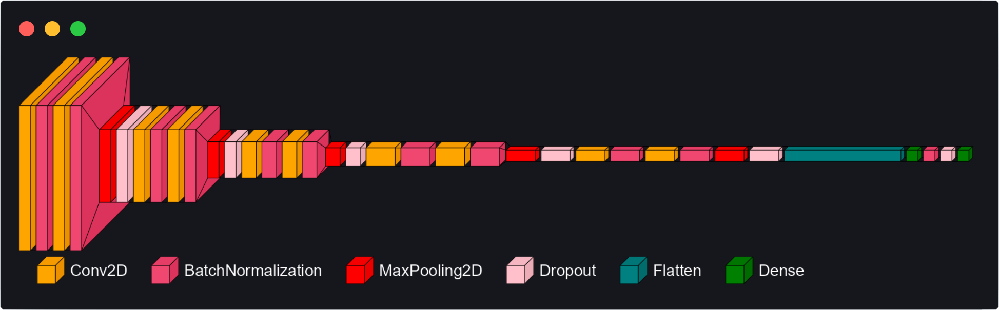
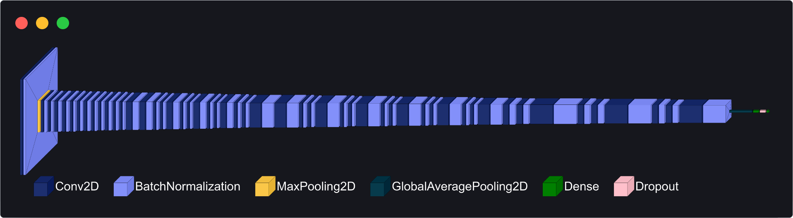
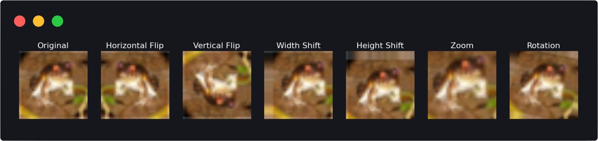

# Project: CNN Classification
## Group 3 - Jiota, Michalis, Gregor

For this project, we were given the choice between the CIFAR-10 and Animals-10 datasets. After careful consideration, we selected the CIFAR-10 dataset due to its manageable complexity and suitability for our objectives. CIFAR-10 is a well-established benchmark dataset that provides a balanced mix of complexity and accessibility, making it particularly advantageous for experimenting with and comparing different convolutional neural network (CNN) architectures. Additionally, its relatively smaller image size and straightforward nature allowed us to focus on the architectural nuances and performance tuning of our models, ultimately facilitating a more efficient and insightful comparison.

### Introduction

The goal of this project is to develop a convolutional neural network (CNN) model to classify images from the CIFAR-10 dataset into ten predefined categories. CNNs are particularly effective for image classification problems due to their ability to automatically learn spatial hierarchies of features through convolutional layers, which makes them well-suited for tasks involving visual data. We utilized two different CNN models for this purpose: a custom CNN model built entirely from scratch and a pre-trained ResNet50 model, leveraging the power of transfer learning. This report provides a comprehensive overview of the approach taken, detailing the preprocessing steps, model architectures, training process, and performance evaluation. Additionally, we highlight the insights gained during experimentation and compare the two models to determine the most effective architecture for this classification task.

 
### Dataset Overview

The CIFAR-10 dataset consists of 60,000 images, each of size 32x32, belonging to ten different classes: airplane, automobile, bird, cat, deer, dog, frog, horse, ship, and truck. One of the main challenges associated with this dataset is its relatively small image size, which can make it difficult for models to extract detailed features. Additionally, the diversity of the classes adds complexity, as the model must learn to differentiate between a wide range of objects, some of which share visual similarities (e.g., cats and dogs). The dataset is split into a training set of 45,000 images, a test set of 10,000 images (which represents 10% of the entire dataset), and a validation set of 5,000 images.

 
### Custom CNN Model

The custom CNN model is designed with five convolutional blocks, each followed by batch normalization and max pooling layers to effectively reduce dimensionality and enhance feature extraction. The first three blocks utilize 128 filters, while the fourth and fifth blocks employ 256 and 512 filters, respectively, allowing the model to learn increasingly abstract representations. Each block includes two Conv2D layers with ReLU activation to introduce non-linearity, followed by Dropout layers to mitigate overfitting, with dropout rates progressively increasing from 0.2 to 0.5 across the blocks. After the convolutional blocks, the network is flattened and followed by a fully connected Dense layer with 128 units, incorporating an additional Dropout layer before the final softmax activation layer for class prediction.
We achieved an accuracy of 0.9202 on the test dataset, which is considered a strong result for a custom-built model without pre-trained features. This performance demonstrates the effectiveness of our architectural choices and optimization techniques. The total number of parameters in this model is 2,221,962.

 
### ResNet50 Model

The second model employed in our experiments is based on the ResNet50 architecture, a highly sophisticated pre-trained model with weights derived from the ImageNet dataset. We leveraged the ResNet50 model as a powerful feature extractor by initially freezing its convolutional base, allowing us to focus on training the added classification layers. Specifically, we appended a GlobalAveragePooling layer, followed by a fully connected Dense layer comprising 512 units and a Dropout layer to mitigate overfitting. The final output layer employed a softmax activation function to classify images into the ten categories.

The training process was conducted over three distinct cycles, where we utilized the saved weights from the previous cycle at the beginning of each subsequent one. To enhance the model's learning capabilities progressively, we unfroze 15 additional layers in the second cycle and 30 layers in the third cycle, enabling the model to fine-tune more complex features and thereby improve its performance. The ResNet50 model consists of a total of 24,641,930 parameters, out of which 1,054,218 were trainable during the training process.

 
### Preprocessing Steps

The CIFAR-10 dataset is well-curated and consistent, which means we did not encounter common data issues such as missing values or class imbalance. This consistency allowed us to streamline our workflow by focusing directly on essential data preprocessing steps, without the need for extensive data cleaning or rebalancing. Additionally, this reliable dataset quality ensured that our preprocessing efforts could be directed towards enhancing model performance rather than dealing with data deficiencies.

* Label One-Hot Encoding: The labels for both training and testing datasets were one-hot encoded to convert the class labels into a binary matrix representation using the to_categorical function. This format is ideal for training the model since it allows for multi-class classification by representing each label as a vector.

* Image Normalization: Image data was normalized by converting the pixel values to the range [0, 1]. Specifically, the images were cast to float32 type and divided by 255.0. This normalization step helps improve the convergence of the model during training by ensuring that the input values are small and centered around zero.

* Image Resizing: The images were resized from their original 32x32 size to enhance feature extraction capabilities. For the custom CNN model, the images were resized to 64x64, while for the ResNet50 model, they were resized to 96x96. This resizing allowed the models to capture finer details and extract more meaningful features, ultimately improving the classification performance.

* Data Augmentation: Data augmentation was performed using the ImageDataGenerator class. This included techniques such as horizontal flipping, vertical flipping, width and height shifts, zoom, and rotation. These transformations were applied to increase the diversity of the training set and help the models generalize better to unseen data.

 
### Best Model and Insights

The best-performing model was the ResNet50 model, with a test accuracy of 95.5%. The use of transfer learning allowed the model to leverage features learned from a large dataset (ImageNet), which improved its performance on CIFAR-10. The custom CNN model, while effective, lacked the complexity and pre-learned features that ResNet50 provided, leading to slightly lower accuracy.
Conclusion

In this project, we successfully implemented and compared two different CNN architectures for image classification on the CIFAR-10 dataset. The ResNet50 model outperformed the custom CNN model, highlighting the benefits of transfer learning and deeper architectures. Future work could involve fine-tuning more layers of the ResNet50 model or experimenting with other pre-trained models to further improve performance.

